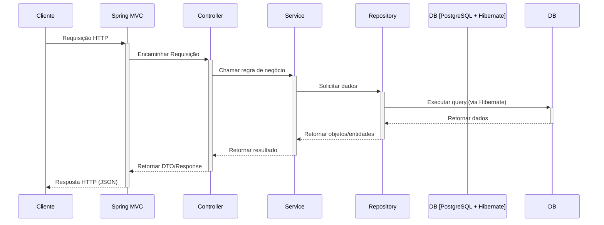

# CarWash API


## 📝 Breve descrição

**CarWash API** é um sistema de back-end para gerenciamento de um lava-rápido. A API permite o controle de clientes, serviços oferecidos e o agendamento desses serviços, fornecendo uma base sólida para a construção de uma aplicação cliente (web ou mobile).

## 🚀 Sobre o Projeto

Este projeto foi criado para centralizar e otimizar a gestão de um lava-rápido. A principal motivação é oferecer uma solução escalável e robusta que organize os agendamentos, facilite o cadastro de serviços e gerencie os usuários do sistema de forma segura.

## ✨ Principais Características

-   **Autenticação de Usuários**: Sistema de login seguro utilizando JSON Web Tokens (JWT).
-   **Gerenciamento de Usuários**: Operações de CRUD (Criar, Ler, Atualizar, Deletar) para usuários.
-   **Gerenciamento de Serviços**: CRUD completo para os serviços oferecidos pelo lava-rápido.
-   **Agendamento de Serviços**: Permite criar, visualizar, atualizar e cancelar agendamentos.

## 📚 Documentação

A documentação detalhada das rotas da API pode ser encontrada na coleção do Postman ou Insomnia. Com o Spring Boot, é comum adicionar o Swagger/OpenAPI para gerar documentação interativa.

*(Esta seção pode ser expandida com links para documentações mais detalhadas, como Swagger/OpenAPI, se implementado no futuro).*

## 🏁 Guia de Início Rápido (Quick Start)

Siga os passos abaixo para configurar e executar o projeto.

### Pré-requisitos

-   [Java (JDK 22)](https://www.oracle.com/java/technologies/downloads/#jdk22-windows)
-   [Maven](https://maven.apache.org/download.cgi)
-   [Docker](https://www.docker.com/get-started) e [Docker Compose](https://docs.docker.com/compose/install/)
-   [Git](https://git-scm.com/)
-   Um cliente de API como [Postman](https://www.postman.com/) ou [Insomnia](https://insomnia.rest/) para testar os endpoints.

### Instalação e Execução (via Docker - Recomendado)

1.  **Clone o repositório:**
    ```bash
    git clone <URL_DO_REPOSITORIO>
    cd carwash
    ```

2.  **Inicie os containers:**
    O arquivo `compose.yaml` irá construir a imagem da aplicação e iniciar os containers do PostgreSQL, da aplicação e do PgAdmin.
    ```bash
    docker-compose up --build -d
    ```

O servidor estará em execução em `http://localhost:8080`.

## 🏗️ Arquitetura da Solução

O sistema segue uma arquitetura em camadas para garantir a separação de responsabilidades, manutenibilidade e escalabilidade, padrão em aplicações Spring Boot. O diagrama de sequência abaixo ilustra o fluxo de comunicação entre os componentes.



### Tecnologias Utilizadas

-   **Back-end**: Java 22
-   **Framework**: Spring Boot
-   **Banco de Dados**: PostgreSQL (gerenciado via Docker)
-   **ORM**: Spring Data JPA / Hibernate
-   **Autenticação**: JSON Web Token (JWT)

### Estrutura do Projeto

O projeto segue a estrutura padrão do Maven:

```
.
├── src/
│   └── main/
│       ├── java/
│       │   └── com/example/carwash/
│       │       ├── config/         # Configurações (ex: Segurança)
│       │       ├── controller/     # Controladores REST
│       │       ├── model/          # Entidades JPA
│       │       ├── repository/     # Repositórios Spring Data JPA
│       │       ├── service/        # Serviços com regras de negócio
│       │       └── CarwashApplication.java # Ponto de entrada
│       └── resources/
│           └── application.properties  # Configurações da aplicação
├── pom.xml                 # Dependências e build do Maven
├── Dockerfile              # Instruções para build da imagem Docker
└── compose.yaml            # Orquestração dos containers
```

### Fluxo de uma Requisição

O fluxo de uma requisição HTTP, conforme ilustrado no diagrama, segue os seguintes passos:

1.  O **Cliente** (ex: Postman, Frontend) envia uma requisição para um endpoint da API.
2.  O **Spring MVC (DispatcherServlet)** recebe a requisição e a direciona para o **Controller** correspondente.
3.  O **Middleware** (como o Spring Security) pode interceptar a requisição para verificar autenticação e autorização.
4.  O **Controller** processa a requisição, valida os dados e chama o **Service** apropriado.
5.  O **Service** contém a lógica de negócio e transações, utilizando um ou mais **Repositories** para interagir com o banco de dados.
6.  O **Repository** (interface Spring Data JPA) executa as operações no banco de dados através do **Hibernate**.
7.  A resposta do banco de dados retorna pela mesma cadeia (Repository → Service → Controller), e o Controller formata a resposta JSON final para o cliente.

