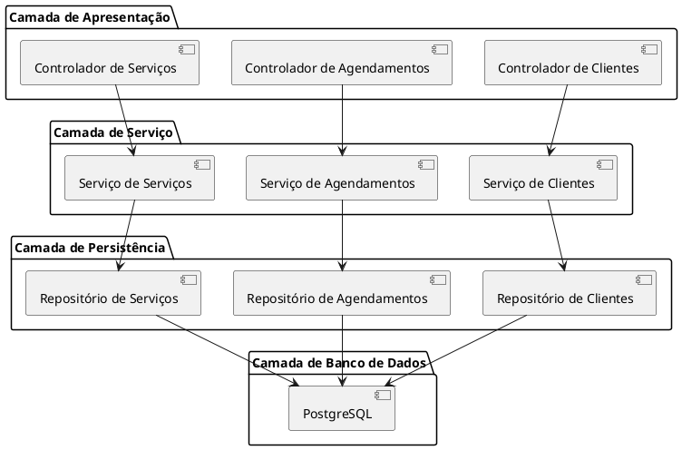

# CarWash System

## Breve descrição
CarWash é um sistema de gerenciamento para empresas de lavagem de carros, permitindo o controle de clientes, agendamentos, serviços e gestão empresarial.

## Sobre o Projeto
O CarWash foi desenvolvido para digitalizar e otimizar o processo de atendimento em lava-jatos e empresas de estética automotiva. A motivação do projeto foi criar uma solução que facilite o gerenciamento de agendamentos, controle de clientes e administração de serviços, proporcionando uma experiência melhor tanto para os proprietários de lava-jatos quanto para seus clientes.

O sistema foi construído utilizando tecnologias modernas e arquitetura escalável para atender desde pequenos estabelecimentos até redes de lava-jatos.

## Principais Características
- Cadastro e gerenciamento de clientes (pessoas físicas e empresas)
- Agendamento de serviços com controle de horários
- Catálogo de serviços personalizáveis
- Gestão de funcionários e permissões
- Dashboard com métricas de desempenho
- Gestão financeira básica
- Sistema de notificações para clientes
- Interface responsiva para acesso via desktop e dispositivos móveis

## Documentação
- [API Documentation](http://localhost:8080/swagger-ui.html) (disponível quando o sistema está em execução)
- [Modelo de Dados](/docs/database-model.md)
- [Manual do Usuário](/docs/user-manual.pdf)

## Guia de Início Rápido (Quick Start)

### Pré-requisitos
- Docker e Docker Compose
- Java 11+ (para desenvolvimento)
- Maven (para desenvolvimento)
- PostgreSQL (se executado fora do Docker)

### Instalação e Execução

#### Utilizando Docker (recomendado)
1. Clone o repositório:
   ```bash
   git clone https://github.com/seu-usuario/carwash.git
   cd carwash
   ```

2. Execute o sistema utilizando Docker Compose:
   ```bash
   docker-compose up -d
   ```

3. Acesse o sistema:
   - Aplicação web: http://localhost:8080
   - PgAdmin (gerenciamento do banco de dados): http://localhost:5050
     - Email: admin@admin.com
     - Senha: admin

#### Para Desenvolvimento Local
1. Clone o repositório
2. Configure o banco de dados PostgreSQL
3. Atualize as configurações de banco de dados em `application.properties`
4. Execute o Maven:
   ```bash
   mvn clean install
   mvn spring-boot:run
   ```

### Credenciais padrão
- **Aplicação**:
  - Usuário: admin@carwash.com
  - Senha: admin123

- **Banco de dados PostgreSQL**:
  - Usuário: postgres
  - Senha: admin
  - Banco de dados: carwash
  - Porta: 5432

## Arquitetura da Solução

### Visão Geral da Arquitetura
O CarWash segue uma arquitetura em camadas baseada em Spring Boot:

- **Camada de Apresentação**: Responsável pela interação com o usuário, utilizando Thymeleaf para renderização de páginas web dinâmicas.
- **Camada de Serviço**: Contém a lógica de negócio da aplicação, onde as regras e processos são implementados.
- **Camada de Persistência**: Gerencia a comunicação com o banco de dados, utilizando Spring Data JPA para abstração e acesso aos dados.
- **Camada de Banco de Dados**: Onde os dados são fisicamente armazenados, utilizando PostgreSQL como sistema gerenciador de banco de dados.

### Diagrama de Arquitetura


## Roadmap
- [x] Cadastro de Clientes
- [x] Cadastro de Funcionários
- [x] Cadastro de Serviços
- [x] Agendamento de Serviços
- [ ] Integração com sistemas de pagamento
- [ ] Relatórios avançados
- [ ] Sistema de fidelidade para clientes

## Contribuindo
Contribuições são bem-vindas! Sinta-se à vontade para enviar pull requests ou relatar problemas.

## Licença
Este projeto está licenciado sob a Licença MIT - veja o arquivo [LICENSE](LICENSE) para detalhes.

## Contato
- **Email**: contato@carwash.com

